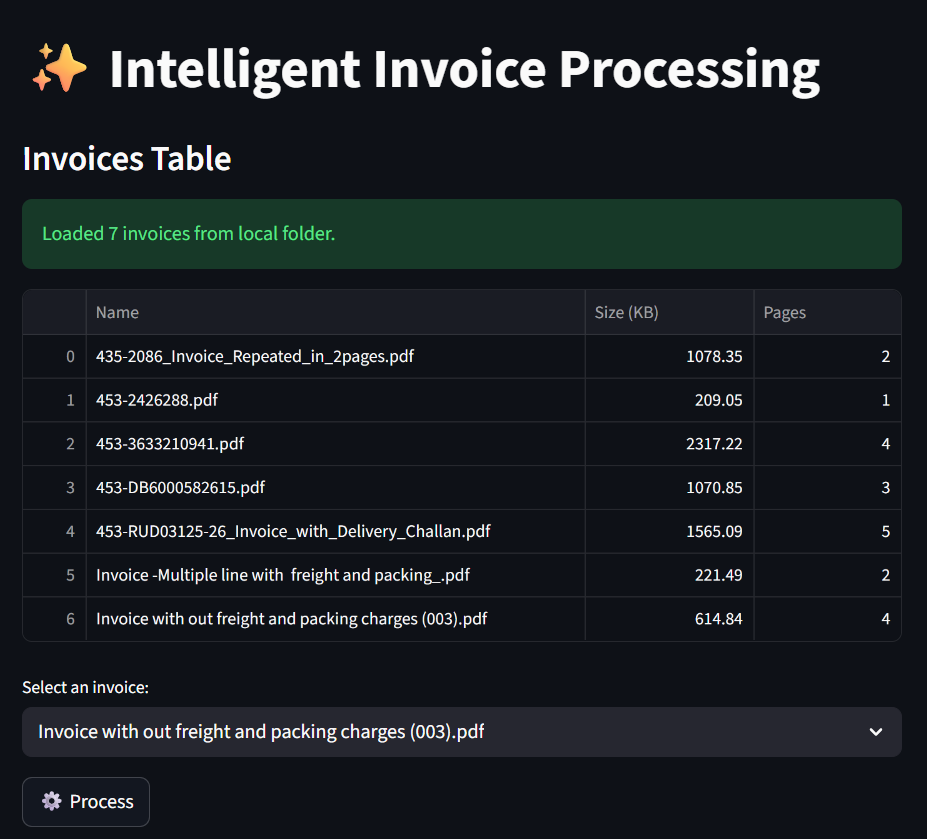

# ✨ Intelligent Invoice Processing POC

A proof-of-concept application demonstrating intelligent invoice processing using Azure AI services. This project combines Azure OpenAI's GPT-4.1 model for document classification and Azure Document Intelligence for structured data extraction from invoices.

<p align="center">
  
</p>

## 🎯 Project Overview

This application provides an end-to-end solution for processing invoice documents:

1. **Document Classification**: Uses `Azure OpenAI GPT-4.1` to identify which pages in a multi-page PDF contain invoices
2. **Data Extraction**: Leverages `Azure Document Intelligence's prebuilt invoice model` to extract structured information
3. **Interactive UI**: Built with `Streamlit` for an intuitive user experience
4. **Visual Display**: Shows extracted invoice data in a clean, organized card layout

## 🏗️ Architecture

The application uses:
- **Azure OpenAI**: For intelligent document classification (GPT-4.1 model)
- **Azure Document Intelligence**: For structured invoice data extraction using the prebuilt invoice model
- **Streamlit**: For the web-based user interface
- **Python**: Core programming language

## 📋 Prerequisites

### Required Azure Resources

You'll need to provision the following Azure resources:

1. **Azure OpenAI Service**
   - Model: GPT-4.1 deployed
   - Required for document page classification

2. **Azure Document Intelligence** (formerly Form Recognizer)
   - Used for extracting structured data from invoices
   - Uses the prebuilt invoice model

### Development Requirements

- Python 3.8 or higher
- pip (Python package installer)

## 🚀 Getting Started

### 1. Clone the Repository

```bash
git clone https://github.com/hosseinzahed/intelligent-invoice-processing-poc.git
cd intelligent-invoice-processing-poc
```

### 2. Set Up Virtual Environment

Create and activate a Python virtual environment:

**Windows (PowerShell):**
```powershell
python -m venv venv
.\venv\Scripts\Activate.ps1
```

**Windows (Command Prompt):**
```cmd
python -m venv venv
venv\Scripts\activate.bat
```

**macOS/Linux:**
```bash
python -m venv venv
source venv/bin/activate
```

### 3. Install Required Packages

Install all dependencies from requirements.txt:

```bash
pip install -r requirements.txt
```

### 4. Configure Environment Variables

Create a `.env` file in the root directory of the project with the following variables:

```env
# Azure OpenAI Configuration
AZURE_OPENAI_ENDPOINT="https://<your-ai-foundry-name>.services.ai.azure.com/"
AI_FOUNDRY_PROJECT_ENDPOINT="https://<your-ai-foundry-name>.services.ai.azure.com/api/projects/<your-project-name>"
AI_SERVICES_ENDPOINT="https://<your-ai-foundry-name>.cognitiveservices.azure.com/"
AI_FOUNDRY_API_KEY="<your-ai-foundry-api-key>"

# Azure Document Intelligence Configuration
DOCUMENT_INTELLIGENCE_API_ENDPOINT="https://<your-document-intelligence-name>.cognitiveservices.azure.com/"
DOCUMENT_INTELLIGENCE_API_KEY="<your-document-intelligence-api-key>"
```

**To obtain these values:**

- **Azure OpenAI**: Navigate to your Azure OpenAI resource in Azure Portal → Keys and Endpoint
- **Document Intelligence**: Navigate to your Document Intelligence resource in Azure Portal → Keys and Endpoint

### 5. Add Invoice Documents

Place your invoice PDF files in the `documents` folder at the root of the project:

```
intelligent-invoice-processing-poc/
├── documents/        # Place your invoice PDFs here
├── src/
├── .env
└── README.md
```

### 6. Run the Application

Navigate to the `src` directory and start the Streamlit application:

```bash
cd src
streamlit run app.py
```

The application will open in your default web browser (typically at `http://localhost:8501`).

## 📖 How to Use

1. **Load Invoices**: Click the "🔃 Load Invoices" button in the sidebar to scan the `documents` folder
2. **Select Invoice**: Choose an invoice from the dropdown menu
3. **Process**: Click the "Process" button to:
   - Convert PDF pages to images
   - Classify pages using GPT-4.1
   - Extract data from invoice pages using Document Intelligence
4. **Review Results**: View the extracted invoice data in a structured format including:
   - Vendor and customer information
   - Invoice details (ID, date, total, etc.)
   - Line items in table format
   - Financial summary
   - Billing and shipping addresses

## 📚 Additional Resources

- [Azure Document Intelligence - Prebuilt Invoice Model](https://learn.microsoft.com/en-us/azure/ai-services/document-intelligence/quickstarts/get-started-sdks-rest-api?view=doc-intel-4.0.0&pivots=programming-language-python#prebuilt-model)
- [Azure OpenAI Service Documentation](https://learn.microsoft.com/en-us/azure/ai-services/openai/)
- [Streamlit Documentation](https://docs.streamlit.io/)

## 📄 License

This project is licensed under the MIT License - see the [LICENSE](LICENSE) file for details.

## ⚠️ Disclaimer

This is a **proof-of-concept (POC)** project created for demonstration and inspiration purposes only. It is not intended for production use without further development, testing, and security hardening.

**Please note:**
- This POC may not handle all edge cases or error scenarios
- Security best practices should be reviewed and implemented before any production deployment
- API keys and sensitive information should be properly secured
- The code is provided "as-is" without warranties of any kind
- Always test thoroughly with your specific use cases before any real-world deployment

Use this project as a starting point and learning resource for building your own intelligent document processing solutions.

## 🤝 Contributing

This is a POC project, but suggestions and improvements are welcome! Feel free to fork the repository and submit pull requests.